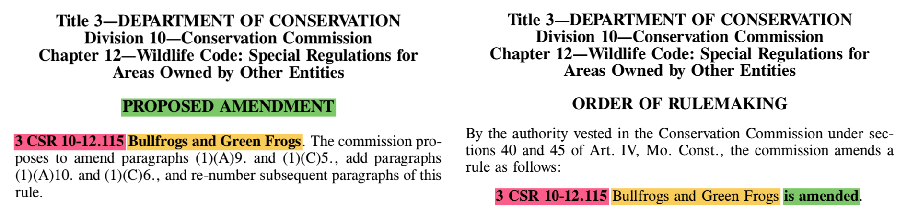

# MOData - Rule Tracker
Extracts structural relational data from Missouri Register regulatory text.

## Background & Summary
Argive created a live rule tracker that follows rule amendments and rescissions through the formal rulemaking process as published in the Missouri Register.

This repo contains the source code for an automated file reader that extracts structural relational data from Missouri Register PDF files.

## Parsing Process
The Missouri Secretary of State publishes rule changes with consistent - and thus predictable - syntax in the [Missouri Register](https://www.sos.mo.gov/adrules/moreg/moreg).



After converting the Missouri Register PDFs into UTF-8 plaintext files, the rule tracker follows a simple algorithm:

1. Search for a key phrase (e.g., `PROPOSED RESCISSION` or `is amended. `)
2. Read the surrounding text up to a stopping point, demarcated by `CSR` or the end of a sentence.
3. Use RegExp to parse key rule information and create a new `Rule` instance.

### Proposed Rules Parser

To parse Proposed Rules, the rule tracker looks for the words `PROPOSED AMENDMENT` or `PROPOSED RESCISSION`, reads forwards until it finds a sentence ending with a period and single space, and uses RegExp to de-structure the resulting `rule_citation` and `rule_description` into a new `Rule` instance.

```ruby
lines.each_with_index do |line, idx|
  if line.include?("PROPOSED AMENDMENT") || line.include?("PROPOSED RESCISSION")
    begin
      jdx = idx
      key_line = lines[jdx]

      until key_line.include?(". ")
        jdx += 1
        key_line = key_line.gsub("\n", " ") + lines[jdx]

        # throws an error for edge cases, expected incidence <1%
        raise "!-- MANUAL REVIEW REQUIRED: Error Buffer Exceeded --!" if jdx - idx >= error_buffer
      end

      action = line.include?("AMENDMENT") ? "Amend" : "Rescind"
      regexp = key_line.match(/^\D*(?<CODE>\d+\s+CSR\s+[-.\d\s]+)\s*(?<DESCRIPTION>.*?)(?=\. .+$)/)
      raise "!-- MANUAL REVIEW REQUIRED: RegExp Returned nil --!" if regexp.nil?

      rule_citation, rule_description = regexp.captures

      add_to_airtable(Rule.new(rule_citation, rule_description, action, "Proposed (Formal)", file_name))
      # [...]
```

### Final Rules Parser
To parse Final Rules, the rule tracker looks for the words `is amended` or `is rescinded` followed by a period and single space, reads backwards until it finds the citation (demarcated with the string `CSR`), and uses RegExp to de-structure the resulting `rule_citation` and `rule_description` into a new `Rule` instance.

```ruby
  lines.each_with_index do |line, idx|
    if line.include?("is amended.") || line.include?("is rescinded.")
      begin
        key_line = line
        jdx = idx

        until key_line.include?("CSR")
          jdx -= 1
          key_line = lines[jdx].gsub("\n", " ") + key_line

          # throws an error for edge cases, expected incidence <1%
          raise "!-- MANUAL REVIEW REQUIRED: Error Buffer Exceeded --!" if idx - jdx >= error_buffer
        end

        action = line.include?("amended") ? "Amend" : "Rescind"
        regexp = key_line.match(/^.*(?<CODE>\d+\s+CSR\s+[-.\d\s]+)\s*(?<DESCRIPTION>.*?)(?=\s+is #{action.downcase}ed.+$)/)
        raise "!-- MANUAL REVIEW REQUIRED: RegExp Returned nil --!" if regexp.nil?

        rule_citation, rule_description = regexp.captures

        add_to_airtable(Rule.new(rule_citation, rule_description, action, "Final Order", file_name))
      # [...]
```

## Potential Future Directions
* Build web-scraper and chron job to download PDFs and run rule tracker at desired intervals.
